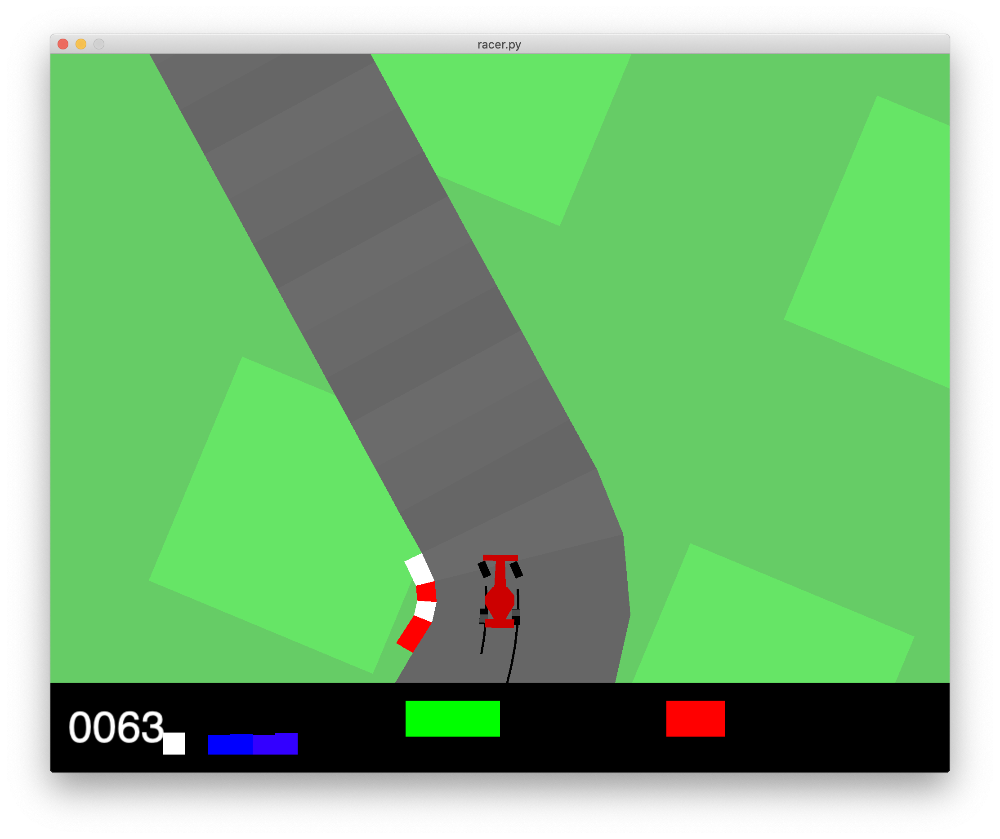

# AI racer

Сreated jointly with @megavaz



## To run this program

0. Install required packages: **numpy, tensorflow 2.\*, gym**
1. Clone this repo  
2. `cd` into it
3. Run  

```bash
python3 racer.py
```

### Note

You can also change driving style and number of frames to be proceed by the model with flags:
  
```bash
python3 racer.py [--style 0 | 1 | 2]
```

```bash
python3 racer.py [--iterations 3000]
```

Detailed explanations are available with command:

```bash 
python3 racer.py --help
```

## About model

In simple terms:

1. Normal style is the style of a sober adequate driver
2. Cutter style is the style of a cunning driver, striving to cut corners of the track
3. Drifter style is the style of a crazy driver who cannot live without drifting


